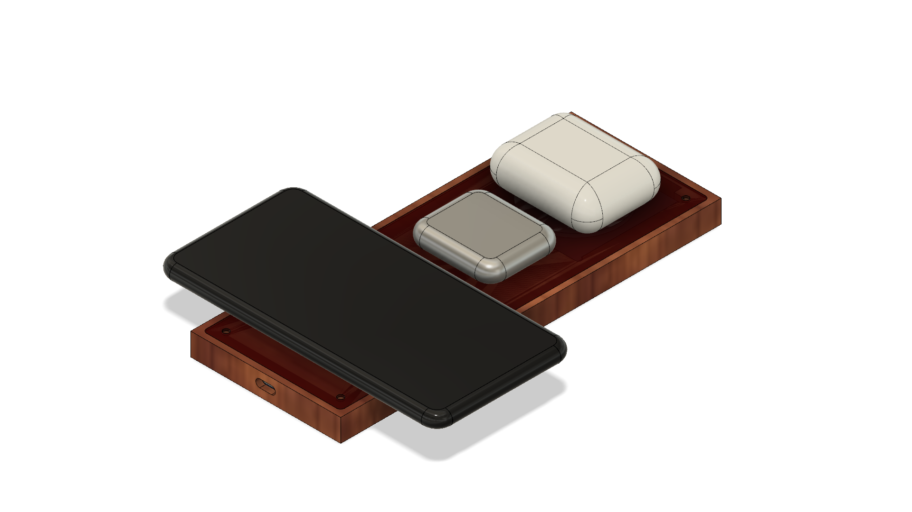

# Charger

Qi charger for iPhone, AirPods, and Apple Watch

## Cutting

- Small router bit 1/8"

1. Mount the material and level it
2. 

### Preparing the bed

- Home machine
- Reset XY origin to 500, 500
- Bed zero at top
- Material thickness 12mm
- Start 0mm
- Cut depth 10mm
- bed-mounting-holes-zero-top.tap

### Top

- Cut the pillar holes (full material depth + 0.5mm)
- Cut away the outer material
- Cut the inner recess (note that in the future this could be cut 1mm higher) 10.5mm (start at top + 10.5mm and cut a depth of 1mm)???

13.0 = level to starting thickness

- Cut the outer profile, after securing the wood with screws
- Cut the recess for the perspex panel / top plate recess (this needs to go to a depth of 10.5, so it's a start of 13-11.5=1.5mm and a depth of 1.0)
- Coil Pocket: start = 13.0-11.5+1.0 = 2.5mm, depth = 4.5mm
- Puck Pocket: start = 13.0-11.5+1.0 = 2.5mm, depth = 6mm

### Bottom

- Plate Pocket: start = 13.0-11.5 = 1.5, depth = 1.0mm
- PCB Pocket: start = 13.0-11.5+1.0 = 2.5, depth = 5.0mm
- Cable Pocket: start = 13.0-11.5+1.0+5.0 = 7.5mm, depth = 2.5mm
- Puck Cable Pocket: start = 13.0-11.5+1.0+5.0 = 7.5mm, depth = 3.5mm
- USB Board Pocket: start = 13.0-11.5+1.0 = 2.5, depth = 3.5mm
- USB Socket Pocket: start = 13.0-11.5+1.0+3.5 = 6mm, depth = 3.5mm

## Olive Wood

Represents a change from a thickness of 11.5 to 13.5.
Material details: 15mm x 206mm x 90mm

Face off from 15mm to 13.5mm. (Height 13.5)

- Face-Off: 15mm, 1.5mm

Top (`olive-top-pockets.tap`):

- Mounting Holes: 1.5mm, 23.5
- Outer Profile: 1.5mm, 14.0
- Top Plate Pocket: 1.5mm, 2.0mm
- Coil Pocket: 3.5mm, 4.5mm
- Puck Pocket: 3.5mm, 6mm

Bottom (`olive-bottom-pockets.tap`):

- Bottom Plate Pocket: 1.5, 2.0
- PCB Pocket: 3.5, 5.0
- Cable Pocket: 8.5, 2.5
- Puck Cable Pocket: 8.5, 3.5
- USB Board Pocket: 3.5, 3.5
- USB Socket Pocket: 7.0, 3.5

# Hardware

18mm

## Qi Charger PCB Mounting

### Bolts (Nylon) x 4

| Feature         | Calculation (mm) | Size (mm) |
| --------------- | ---------------- | --------- |
| Head Diameter	  | 6.0              |           |
| Head Depth      | 2.0              |           |
| Thread Diameter | 3.0              |           |
| Thread Length   | 2.5 + 5.0        |           |

### Nuts (Nylon) x 4

| Feature         | Calculation (mm) | Size (mm) |
| --------------- | ---------------- | --------- |
| Thread Diameter | 3.0              |           |
| Depth           | 2.0              |           |

### Washers (Nylon) x 8

| Feature         | Calculation (mm) | Size (mm) |
| --------------- | ---------------- | --------- |
| Thread Diameter | 3.0              |           |
| Thread Length   | 2.5 + 5.0        |           |
| Depth           | 1.0              |           |

_The washers are required as the PCBs are double-sided and need to be distanced from the base plane of the case._

## USB-C PCB Mounting

### Bolts (Nylon) x 4

| Feature         | Calculation (mm) | Size (mm) |
| --------------- | ---------------- | --------- |
| Head Diameter | 5.0             |           |
| Head Depth   | 2.0        |           |
| Thread Diameter           | 3.0              |           |
| Thread Length           | 4.0 + 3.5              |           |

_N.B. The thread diameter here seems off; I don’t believe these are M3 boards. Either that, or the measurements on the Qi charger PCBs are off._

_No washers are required as the board needs to sit flush with the case to ensure the USB-C port aligns correctly._

## Case Mounting

### Bolts (Brass) x 4

| Feature         | Calculation (mm) | Size (mm) |
| --------------- | ---------------- | --------- |
| Head Diameter   | 6.0              |           |
| Head Depth      | 4.0              |           |
| Thread Diameter | 3.0              |           |
| Thread Length   | 13.5 + 1.0 + 4.0 | 18.0      |

_Trying with a 16.0 mm screw in the first instance.

### Nuts (Brass) x 4

| Feature         | Calculation (mm) | Size (mm) |
| --------------- | ---------------- | --------- |
| Thread Diameter | 3.0              |           |
| Depth           | 2.0              |           |
